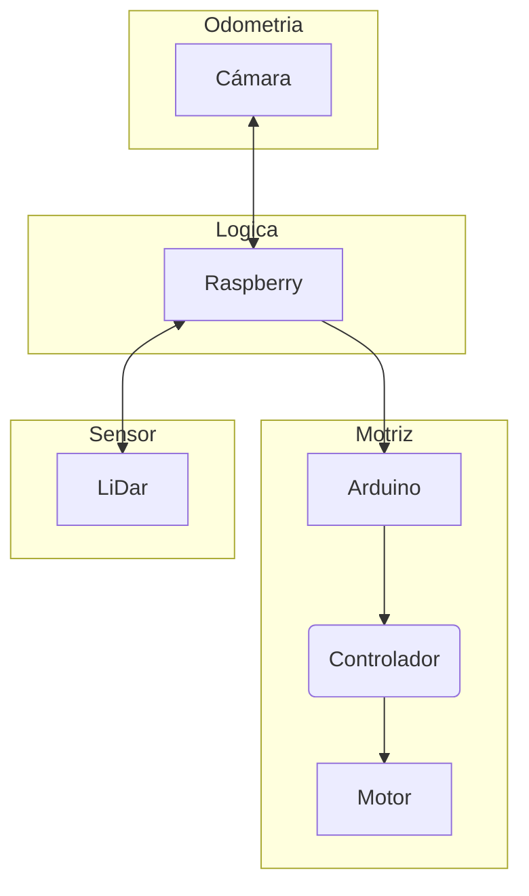

# L'Alcudia Robotics 
No se, dadme ideas para el README

Aún falta definir que tipos de actuadores necesitaremos para cumplir los distintos retos del Eurobot.
Podemos ir a cosas específicas o a actuadores generales que funcionen bien en cualquier escenario.

La estructura básica sin actuadores seria como el esquema que Liu puso abajo.

## Estructura lógica

