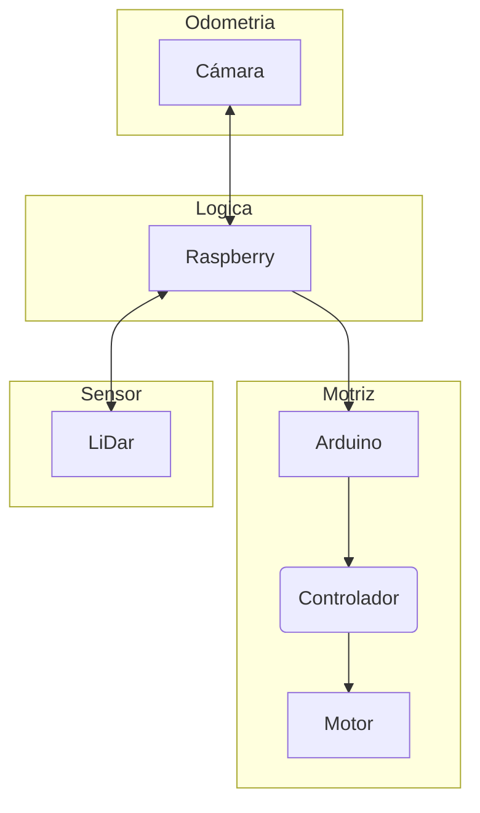

# L'Alcudia Robotics 
No se, dadme ideas para el README

## Estructura lógica

```mermaid
flowchart TB;
  subgraph Logica
    Raspberry;
  end 
  Raspberry --> Arduino
  subgraph Motriz
    Arduino --> Driver("Controlador")
    Driver --> Motor
  end
  subgraph Sensor
    Raspberry <--> LiDar
  end
  subgraph Odometria
    Cámara <--> Raspberry
  end
```

